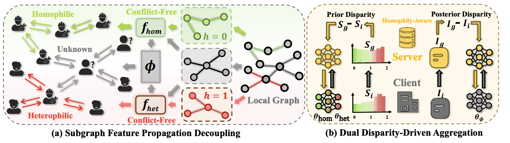








My name is Guancheng Wan (万冠呈), I'm a 4rd-year undergraduate student at the School of Computer Science, Wuhan University, supervised by [Mang Ye](https://marswhu.github.io/index.html). I'm currently a research intern at Emory University, supervised by [Wei Jin](https://scholar.google.com/citations?user=eWow24EAAAAJ&hl=en&oi=ao). I also worked with [Nitesh V Chawla](https://scholar.google.com/citations?hl=en&user=hDLBEhkAAAAJ), [B. Aditya Prakash](https://scholar.google.com/citations?user=C-NftTgAAAAJ),  and [Qiang Yang](https://scholar.google.com/citations?user=1LxWZLQAAAAJ&hl=en).  

🌟 I'm actively applying for a Ph.D. position in 2025 Fall!

<!-- 🌟 I'm currently actively seeking for Ph.D., Research Assistant, or internship positions related to Graph Learning. I'm also open to any possible discussions or collaborate opportunities. If you're interested in working with me, don't hesitate to drop me an email!  -->

<!-- My curriculum vitae (**CV**) can be downloaded [here](https://github.com/GuanchengWan/guanchengWan.github.io/raw/master/docs/GuanchengWan_cv.pdf).  -->

# 🔎 Research 
"All things are interconnected, this is the essence of nature." 

I am enthusiastic about modeling the relationship of these connections, particularly focusing on <u>geometric data</u>. Currently, my research interests revolve around three primary areas: 

a) AI for Science:  
- Bioinformatics (*e.g.*, Genomics)

- Public Health (*e.g.*, Epidemiology)

- Physics (*e.g.*, Neural ODE, Neural Operator)

b) TrustWorthy Graph Learning

c) Self-supervised Graph Learning

 

# 🔥 News

<ul>
  <li><em>2024.09:</em> ✨✨✨ Two papers were accepted by <strong>NeurIPS 2024</strong>, congrats to Wenke and Zihan! See you in Vancouver.</li>
  <li><em>2024.08:</em> Organize a tutorial at <strong>KDD 2024</strong> in Barcelona on 25th, come if you are interested in epidemics + GNN!</li>
  <li><em>2024.08:</em> I serve as a reviewer for <strong>ICLR 2025</strong>.</li>
  <li><em>2024.06:</em> ✨✨✨ One paper is accepted by <strong>TPAMI</strong>, congrats to all collaborators!</li>
  <li><em>2024.05:</em> I serve as a reviewer for <strong>NeurIPS 2024</strong>.</li>
  <li><em>2024.05:</em> ✨✨✨ Our survey about GNNs in Epidemic Modeling is accepted by <strong>KDD 2024</strong>. See you in Barcelona!</li>
  <li><em>2024.05:</em> ✨✨✨ One paper about self-supervised graph learning was accepted by <strong>ICML 2024</strong>. See you in Austria!</li>
  <li><em>2024.04:</em> 🚀🚀🚀 Explore our pre-print: a deep look at using Graph Neural Networks in Epidemic Modeling. Check our collected <a href="https://github.com/Emory-Melody/awesome-epidemic-modeling-papers">paper list</a>.</li>
  <li><em>2024.02:</em> I serve as a reviewer for <strong>ACM MM 2024</strong>.</li>
  <li><em>2024.02:</em> I serve as a reviewer for <strong>ECCV 2024</strong>.</li>
  <li><em>2023.12:</em> A paper was accepted to <strong>AAAI 2024</strong>. See you in Vancouver.</li>
  <li><em>2023.11:</em> I serve as a reviewer for <strong>CVPR 2024</strong>.</li>
  <li><em>2023.11:</em> 🚀🚀🚀 We thoroughly explore three core research areas in federated learning: generalization, robustness, and fairness. Don't hesitate to utilize our <a href="https://github.com/WenkeHuang/MarsFL">benchmarking codes</a> for your own research goal!</li>
  <li><em>2023.10:</em> I attended China National Computer Congress (CNCC) and was awarded the honor of CCF (China Computer Federation) Elite Collegiate Award (102 Students nation-wide).</li>
  <li><em>2023.10:</em> I won the National Scholarship for the second time (0.2% nation-wide), and was selected the Pacemaker to Merit Student (Award Rate: 60/59774=0.1%).</li>
  <li><em>2023.08:</em> We attended <em>The 32nd INTERNATIONAL JOINT CONFERENCE ON ARTIFICIAL INTELLIGENCE (<strong>IJCAI</strong>)</em> and presented our work in Macao.</li>
</ul>

 

# 📃 Publications 

**&dagger; Equal Contribution**   

<dl>
  <dt>
</dt>
  <dd><a href="https://proceedings.mlr.press/v235/wan24g.html"><strong>S3GCL: Spectral, Swift, Spatial Graph Contrastive Learning
</strong></a></dd>
<dd><strong><u>Guancheng Wan</u></strong>, Yijun Tian, Wenke Huang, Nitesh V Chawla, Mang Ye</dd>
    <dd>International Conference on Machine Learning (<strong>ICML</strong>), 2024 </dd>
</dl>

<dl >
  <dt></dt>
  <dd ><a href="https://ojs.aaai.org/index.php/AAAI/article/view/29468"><strong> Federated Graph Learning under Domain Shift with Generalizable Prototypes</strong></a></dd>
  <dd><strong><u>Guancheng Wan</u></strong>, Wenke Huang, Mang Ye</dd>
    <dd> Annual AAAI Conference on Artificial Intelligence (<strong>AAAI</strong>), 2024</dd>

</dl>

<dl>
  <dt>
</dt>
  <dd><a href=""><strong>FedSSP: Federated Graph Learning with Spectral Knowledge and Personalized Preference</strong></a></dd>
<dd>Zihan Tan&dagger;, <strong><u>Guancheng Wan&dagger; </u></strong>(co-first), Wenke Huangn &dagger;, Mang Ye</dd>
<dd>Annual Conference on Neural Information Processing Systems (<strong>NeurIPS</strong>), 2024</dd>
</dl>

<dl >
  <dt>
</dt>
  <dd><a href="https://dl.acm.org/doi/pdf/10.1145/3637528.3671455"><strong>A Review of Graph Neural Networks in Epidemic Modeling</strong></a></dd>
<dd>Zewen Liu&dagger;, <strong><u>Guancheng Wan&dagger; </u></strong>(co-first), B. Aditya Prakash, Max S. Y. Lau, Wei Jin</dd>
    <dd>ACM SIGKDD Conference on Knowledge Discovery and Data Mining (<strong>KDD</strong>), 2024</dd>
    <dd><a href="https://github.com/Emory-Melody/awesome-epidemic-modeling-papers">Project Page</a></dd>
</dl>

<dl>
  <dt></dt>
  <dd><a href="https://arxiv.org/pdf/2406.18937"><strong>Federated Graph Semantic and Structural Learning</strong></a></dd>
  <dd>Wenke Huang&dagger;, <strong><u>Guancheng Wan&dagger; </u></strong>(co-first), Mang Ye, Bo Du</dd>
  <dd> International Joint Conference on Artificial Intelligence (<strong>IJCAI</strong>), 2023  </dd>
</dl>

<dl>
  <dt>
</dt>
  <dd><a href="https://arxiv.org/abs/2311.06750"><strong>Federated Learning for Generalization, Robustness, Fairness: A Survey and Benchmark</strong></a></dd>
  <dd>Wenke Huang, Mang Ye, Zekun Shi, <strong><u>Guancheng Wan</u></strong>, He Li, Bo Du,  Qiang Yang
  </dd>
    <dd>IEEE Transactions on Pattern Analysis and Machine Intelligence (<strong>TPAMI</strong>), 2024</dd>
    <dd><a href="https://github.com/WenkeHuang/MarsFL">Project Page</a></dd>
</dl>

<dl>
  <dt>
</dt>
  <dd><a href=""><strong>	
Parameter Disparities Dissection for Backdoor Defense in Heterogeneous Federated Learning</strong></a></dd>
  <dd>Wenke Huang, Mang Ye, Zekun Shi, <strong><u>Guancheng Wan</u></strong>, He Li, Bo Du
  </dd>
  <dd>Annual Conference on Neural Information Processing Systems (<strong>NeurIPS</strong>), 2024</dd>
    
</dl>

 

# 📝 Manuscripts

<dl>
  <dt>
</dt>
  <dd><a href=""><strong>Epidemiology-Aware Neural ODE with Continuous Disease Transmission Graph</strong></a></dd>
<dd><strong><u>Guancheng Wan</u></strong>, Zewen Liu, Max S.Y. Lau, B. Aditya Prakash, Wei Jin</dd>
<dd>under review, 2024</dd>

</dl>

<dl>
  <dt>
</dt>
  <dd><a href=""><strong>	
Generalizable Federated Graph Learning under Homophily Heterogeneity
</strong></a></dd>
<dd>Zihan Tan&dagger;, <strong><u>Guancheng Wan&dagger; </u></strong>(co-first), Yijun Tian, Wenke Huang, He Li, Bo Du, Mang Ye</dd>
<dd>under review, 2024</dd>

</dl>

 

# 🎡 Service
## Conference Committee Member
- Reviewer for ICLR'2025
- Reviewer for NeurIPS'2024
- Reviewer for CVPR'2024
- Reviewer for ECCV'2024
- Reviewer for AAAI'2024, 2025
- Reviewer for ACM MM'2024
- Reviewer for LoG'2024

##  Journal Reviewer
- Reviewer for IEEE Transactions on Information Forensics and Security (TIFS)
- Reviewer for IEEE Transactions on Knowledge and Data Engineering (TKDE)
- Reviewer for IEEE Transactions on Neural Networks and Learning Systems (TNNLS)
- Reviewer for Data-centric Machine Learning Research (DMLR)

 

# 🎖 Scholarships and Honors

- *2024.06* **Lei Jun Computer Innovation and Development Fund** and  **Research Fund** (雷军创新发展基金、雷军研究基金) (3 Students department-wide)  *Wuhan University*

- *2024.06* <a href="https://scholarship2024.sensetime.com/cn/">**SenseTime Scholarship**</a> (商汤奖学金) (**25 Students nation-wide**) *SenseTime*

- *2024.04* <a href="https://mp.weixin.qq.com/s/zdx8hH8-g0FScgZvkYQRnw">**CS Pioneer**</a> (计科先锋年度人物) (10 Students department-wide)  *Wuhan University*

- *2023.10* **CCF (China Computer Federation) Elite Collegiate Award** (CCF优秀大学生) (102 Students nation-wide) *China Computer Federation*

- *2023.10* **Pacemaker to Merit Student** (三好学生标兵) (Award Rate: 60/59774=<strong>0.1%</strong>) *Wuhan University*
- *2023.09* **National Scholarship** **(<u>Twice</u>)** (国家奖学金 ) (Award Rate: <strong>0.2% nation-wide</strong>) *Ministry of Education, China* 
- *2023.09* **First Class Scholarship** (Award Rate: 5% school-wide) *Wuhan University* 

- *2022.10* **Merit Student**  (Award Rate: 10% school-wide) *Wuhan University* 
- *2022.09* **National Scholarship** (国家奖学金) (Award Rate: <strong>0.2% nation-wide</strong>) *Ministry of Education, China* 
- *2022.09* **First Class Scholarship** (Award Rate: 5% school-wide) *Wuhan University* 
- *2022.09* **Excellent Student Cadre** (Award Rate: 924/59774=1.5%) *Wuhan University*

 

# 📖 Educations
- *2021.09 - Now*, Undergraduate, School of Computer Science, Wuhan University, China. 

<dl></dl>

# Miscellaneous

  
<strong>Talks and Shares</strong>

<dd><a href="https://www.bilibili.com/video/BV1gZ42177VL/?spm_id_from=333.337.search-card.all.click&vd_source=0b7a3cc3d3ec288abaca83b9a7e036af"><strong>泛化图学习与本科生科研经历分享</strong></a></dd>

<dd><a href="https://www.bilibili.com/video/BV1UM4m127uT/?spm_id_from=333.999.0.0"><strong>VALSE Share: Federated Graph Learning under Domain Shift with Generalizable Prototypes</strong></a></dd>

  
<strong>Poems That Inspire Me</strong>

  <dd><strong>白鹭立雪，愚者看鹭，聪者观雪，智者见白</strong> —— A white egret stands in the snow. The foolish see only the egret, the wise observe the snow, and the enlightened perceive the whiteness.</dd>
  <dd><strong>世界不黑也不白,而是一道精致的灰</strong> —— The world is neither black nor white, but a delicate shade of gray. </dd>

  

 

Handwriting of my Chinese name:
<dl></dl>

 

 

